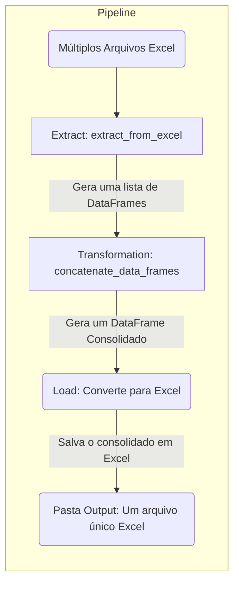

# Workflow

# Função de extração de dados

## ::: app.pipeline.extract.extract_from_excel

# Função de transformação de dados

## ::: app.pipeline.transform.concatenate_data_frames

# Função de carga de dados

## ::: app.pipeline.load.load_excel
